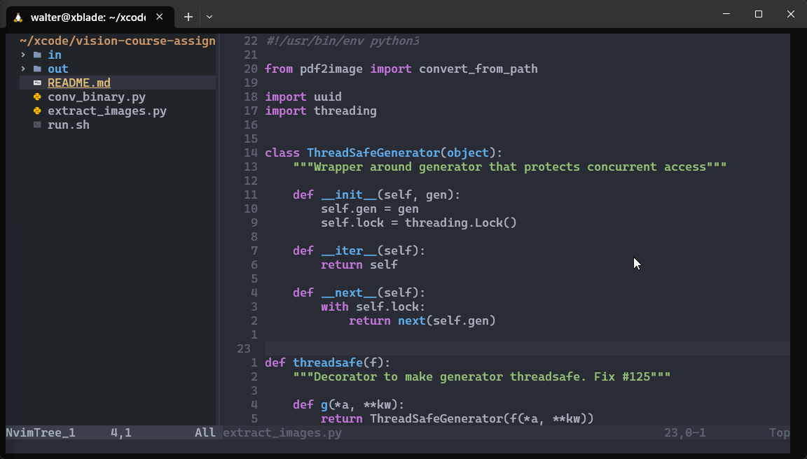

# Neovim configs with lua.



# install instructions 
- install packer.nvim
```
  git clone --depth 1 https://github.com/wbthomason/packer.nvim\
 ~/.local/share/nvim/site/pack/packer/start/packer.nvim
 ```
 - clone this repo and rename the dir to nvim 
 ```
 mv ~/.config/nvim ~/.config/nvim-backup
 cd ~/.config 
 git clone https://github.com/aswinpajayan/neovim-lua-dotfiles.git
 mv neovim-lua-dotfiles.git
 ```
 - install pynvim and node neovim if not already installed 
 ```
 pip install pynvim 
 node install neovim
 ```
 - open nevoim and do a packersync
 ```
 nvim
 :PackerSync
 ```
 
